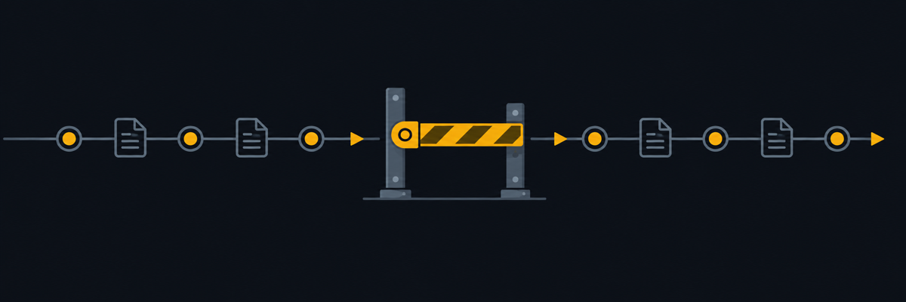

# Minel GTM Harness



A small, deterministic reference implementation of the core mechanic behind any serious outbound GTM system: a scoring gate a message must click through before it ships, and a sequencer that tracks where a contact sits in a cadence over time — plus the two things most demo repos skip: a real audit trail and a real kill switch.

No LLM calls. No live send capability of any kind. No API keys. Clone it and run it.

## What's in here

- **The Latch** — a rules engine that scores a draft message against a pluggable rule set and returns `PASS` / `HOLD` / `FAIL`, with the exact rule that fired and why.
- **The Tether** — a sequencer that holds a contact's state (their **Manifest**) and advances them through a defined touch cadence, reporting what's next and when it's due.
- **The Rungs: Clear / Flag / Hold** — a config value on every rule and every sequence step, describing how much autonomy that item gets. Demonstrated, not wired to any real channel.
- **The Trail** — an append-only, JSON-lines log of every Latch verdict and every Tether action. Every row is versioned (`schema_version`) from day one.
- **The Cutoff** — one command that halts every Tether advance and forces every Latch verdict to `HOLD`, instantly, and it persists — it's honored the moment the next command runs, even in a fresh process.

All demo data (the contact, the company, the messages) is fictional.

## Install

```bash
git clone <this-repo>
cd minel-gtm-harness
node bin/minel.js demo
```

That's it. No `npm install` step — zero runtime dependencies. Requires Node ≥18.

## Quick start

```bash
# Score a draft message against the demo rule set
node bin/minel.js latch score config/demo-messages/clean-pass.json

# Advance a fictional contact through the demo sequence
node bin/minel.js tether advance --contact jordan-vale-bramblewood

# See what's due next, without advancing
node bin/minel.js tether status --contact jordan-vale-bramblewood

# Read the last few rows of the audit trail
node bin/minel.js trail tail -n 5

# Halt everything
node bin/minel.js cutoff on --reason "pausing for a rule-set update"
node bin/minel.js cutoff status
node bin/minel.js cutoff off
```

## A real transcript

This is actual output from `node bin/minel.js demo`, captured on a clean checkout — not hand-written.

```
=== Minel GTM Harness — demo ===

-- The Latch: scoring three demo messages --

> minel latch score config/demo-messages/clean-pass.json
Latch verdict: PASS
Reasons: none — no rule fired.

> minel latch score config/demo-messages/banned-phrase-fail.json
Latch verdict: FAIL
Reasons:
  - [banned-phrases/hold] banned phrase found: "act now"

> minel latch score config/demo-messages/multi-ask-hold.json
Latch verdict: HOLD
Reasons:
  - [one-ask-only/flag] message contains 3 asks, more than the allowed 1

-- The Tether: advancing a fictional contact through its sequence --

> minel tether advance --contact jordan-vale-bramblewood
Tether: advanced (fired step "connect" (rung: clear))
Contact: jordan-vale-bramblewood
Status: active
Last touch: 2026-09-15
Next action: "message" (rung: flag), due 2026-09-18

-- The Trail: the last few rows written above --

> minel trail tail -n 4
{"schema_version":1,"ts":"2026-09-15T16:44:29.437Z","type":"latch_verdict","messageFile":".../clean-pass.json","verdict":"PASS","firedRules":[]}
{"schema_version":1,"ts":"2026-09-15T16:44:29.438Z","type":"latch_verdict","messageFile":".../banned-phrase-fail.json","verdict":"FAIL","firedRules":[{"id":"banned-phrases","rung":"hold","reason":"banned phrase found: \"act now\""}]}
{"schema_version":1,"ts":"2026-09-15T16:44:29.439Z","type":"latch_verdict","messageFile":".../multi-ask-hold.json","verdict":"HOLD","firedRules":[{"id":"one-ask-only","rung":"flag","reason":"message contains 3 asks, more than the allowed 1"}]}
{"schema_version":1,"ts":"2026-09-15T16:44:29.445Z","type":"tether_advance","contactId":"jordan-vale-bramblewood","advanced":true,"reason":"fired step \"connect\" (rung: clear)","nextAction":{"step":"message","rung":"flag","dueAt":"2026-09-18"}}

-- The Cutoff: engage it, then show it halts both the Latch and the Tether --

> minel cutoff on --reason "demo"
Cutoff engaged. All Latch verdicts will read HOLD; all Tether advances are halted.

> minel latch score config/demo-messages/clean-pass.json
Latch verdict: HOLD
Reasons:
  - the Cutoff is engaged — every Latch verdict is forced to HOLD

> minel tether advance --contact jordan-vale-bramblewood
Tether: did not advance (the Cutoff is engaged — all Tether advances are halted)
...

> minel cutoff off
Cutoff disengaged. Normal operation resumed.

=== demo complete ===
```

(Full file paths in the Trail rows above were shortened to `.../filename.json` for README width — the real output prints the absolute path.)

## Configuring your own rules and sequence

Both the Latch's rule set (`config/rules.json`) and the Tether's sequence (`config/sequence.json`) are plain JSON — no code changes needed to add a rule or a step. Four rule types ship in the demo set:

| type | what it checks |
|---|---|
| `banned-phrases` | the message text contains any phrase from a list |
| `max-asks` | the message text asks more than N questions |
| `stale-reference-date` | a named date field is older than N days |
| `required-fields` | one or more named fields are missing or empty |

Every rule and every sequence step carries a `rung`: `"clear"`, `"flag"`, or `"hold"`. A fired rule's rung decides the Latch's verdict — the worst rung among everything that fired wins: any `hold`-rung rule firing means `FAIL`; otherwise any `flag`-rung rule firing means `HOLD`; nothing firing (or only informational `clear`-rung rules) means `PASS`.

## Architecture, in one paragraph

`bin/minel.js` is a thin CLI router. Every real piece of logic lives in `src/` as a pure function over plain data (`latch.js`, `tether.js`) — no file I/O inside them, which is what makes them trivially unit-testable. `src/state.js` is the one file-I/O boundary in the whole codebase: every write goes through it, using a temp-file-then-rename pattern so a state file is never left half-written, even if the process is killed mid-write. The Cutoff (`src/cutoff.js`) and the Manifest (`src/manifest.js`) are thin persistence wrappers around that same boundary. The Trail (`src/trail.js`) is a separate append-only path, because appending a single line is already atomic on POSIX filesystems and doesn't need the rename dance.

## What v1 does not do

No live send integration of any kind (email, LinkedIn, or otherwise). No LLM call anywhere — scoring is fully deterministic. No UI, dashboard, or web frontend — this is a CLI/library. No multi-user, auth, or hosting layer. These aren't missing by accident — the code is structured with named seams (see the doc comments in `src/latch.js` and `src/tether.js`) so they can be added later without a rewrite, but v1 deliberately ships none of them.

## Testing

```bash
npm test
```

Runs the full suite with Node's built-in test runner (`node --test`) — no test framework dependency either.

## License

MIT
